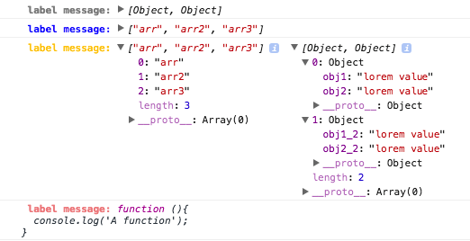
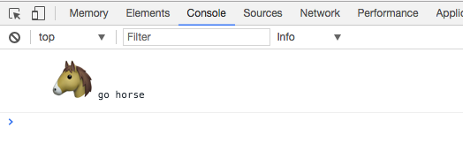
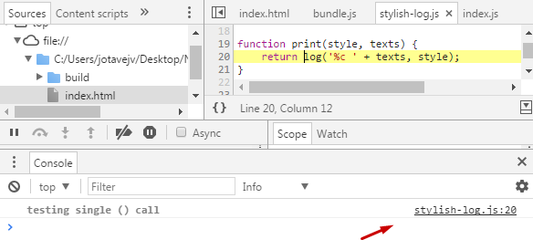
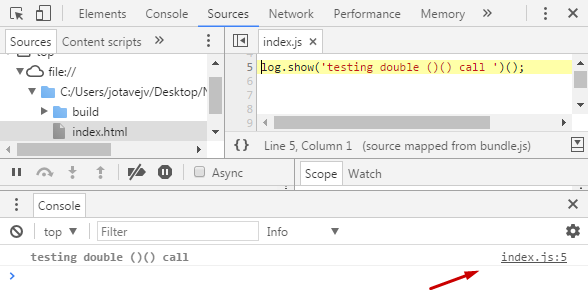

# stylish-log
### A *stylish* `console.log`

Transform your `console.log` into a customized logs.
This not override the default `console.log`, it just add a new way to debug with **CSS styles**.

## How to install

```js
npm install stylish-log
```

Then you call it with `import` or `require`:
```js
import log from 'stylish-log'

//OR

const log = require('stylish-log');
```

## How to use

There are **4 stylish-log methods** that you can use:

- log.show
- log.info
- log.warn
- log.danger


The default styles for these methods are:
```js
const styles = {
  default: 'color: gray; font-weight: bold;',
  info: 'color: blue; font-weight: bold;',
  warn: 'color: #ffc107;',
  danger: 'color: lightcoral; font-weight: bold;'
}
```

## Basic examples

See how this example are shown in console
```js
log.show('default')();
log.info('info')();
log.warn('warn')();
log.danger('danger')();
```


You can pass how many values you want to **stylish-log methods**, if you have more than just one, the first *string* message becomes a *"label message"* for your log. Take a look:


```js
const arrObj = [
  {
    "obj1": "lorem value",
    "obj2": "lorem value"
  },
  {
    "obj1_2": "lorem value",
    "obj2_2": "lorem value"
  }
]
const arr = ['arr', 'arr2', 'arr3'];

const fn = function(){
  console.log('A function');
}

//call stylish-log for each value passing a custom message label

log.show('label message:', arrObj)();
log.info('label message:', arr)();
log.warn('label message:', arr, arrObj)();
log.danger('label message:', fn)();
```

See how this example are shown in console



### How to change the default style

You have total freedom to override the default styles for each method

```js
log.styles.default = 'font-size: 14px; color: #795548; text-transform: uppercase;';
log.styles.info = 'font-size: 14px; background: #4fc3f7; color: white;';
log.styles.warn = 'font-size: 14px; color: black; background: linear-gradient(to right, #ffa726, #ffe0b2)';
log.styles.danger = 'font-size: 14px; color: white; text-shadow: 0 1px 0 black, 0 0 8px red;';
```


As you can see even gradients are supported.

Se another example with **images**:

```js
log.styles.default = 'background: url(https://i.imgflip.com/1plo8j.jpg) left bottom no-repeat; background-size: contain; display: block; padding: 150px 80px';

log.show('')();
```
Assuming that the `padding` is respectively `height` and `width` you can set an image to console.
In this case the **default style** was overrided and then `log.show('')()` was called, passing an **empty string** to initiate the *image* log.

;

What about **emojis**? Yes you can!

```js
log.styles.default = 'font-size: 50px;';

log.show('🐴', 'go horse')();
```


## Important
You should have noticed about the **double ()()** call from the methods in the examples. There was a initial version (*not published*) that you could just call the methods with **single ()**, the reason of the double **()()** are the *stack line log in the console*. 
You can see the difference between below:

```js
log.show('testing single () call');
```
<!--  -->


```js
log.show('testing double ()() call')();
```
<!--  -->



## Why?

In fact, this module is just a stylish `console.log` which provides a simple way to customize your logs with CSS styles.
You can take the same effect using the example `console.log(%c My log message, 'color: gray; font-weight: bold;')` this will generate the same result as `log.show('My log message')()`.

If you prefer a elegant and useful way to style your console, few free to use and enjoy it.

### TODO

- Custom methods
- Preview improvements
- Icons

---

###### A special thanks to [@UltCombo](https://github.com/UltCombo)
