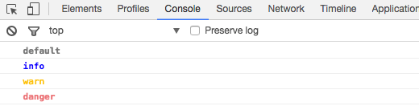
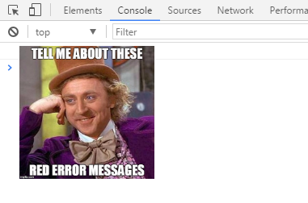

# App debugger
### A `console.log` with *super powers*!

Transform your `console.log` into a customizable logs.
This not override the default `console.log`, it just add a new way to debug with **css styles**.

## How to install

```js
npm install app-debugger
```

Then you call it with `import` or `require`:
```js
import debug from 'app-debugger'

//OR

const debug = require('app-debugger');
```

## How to use

The are *4 methods* that you can use:
```js
debug.show
debug.info
debug.warn
debug.danger
```

The default styles for this methods are:
```js
const styles = {
  default: 'color: gray; font-weight: bold;',
  info: 'color: blue; font-weight: bold;',
  warn: 'color: #ffc107;',
  danger: 'color: lightcoral; font-weight: bold;'
}
```

## Basic examples

See how this example are shown in console
```js
debug.show('default')();
debug.info('info')();
debug.warn('warn')();
debug.danger('danger')();
```



You can pass how many values you want to **debug methods**, if you have more than just one, the first *string** message becames a "label message" for your log. Take a look:


```js
const arrObj = [
  {
    "obj1": "lorem value",
    "obj2": "lorem value"
  },
  {
    "obj1_2": "lorem value",
    "obj2_2": "lorem value"
  }
]
const arr = ['arr', 'arr2', 'arr3'];

const fn = function(){
  console.log('A function');
}

//call debug for each value passing a custom message label

debug.show('label message:', arrObj)();
debug.info('label message:', arr)();
debug.warn('label message:', arr, arrObj)();
debug.danger('label message:', fn)();
```

See how this example are shown in console


### How to change the default style

You have totally independence to override the default styles for each method

```js
debug.styles.default = 'font-size: 14px; color: #795548; text-transform: uppercase;';
debug.styles.info = 'font-size: 14px; background: #4fc3f7; color: white;';
debug.styles.warn = 'font-size: 14px; color: black; background: linear-gradient(to right, #ffa726, #ffe0b2)';
debug.styles.danger = 'font-size: 14px; color: white; text-shadow: 0 1px 0 black, 0 0 8px red;';
```


As you can see even gradients are supported. Se another example with images:

;

What about emojis? Yes you can!


## Important
You should have noticed about...

## Why using it?

In fact, this module is just a stylish `console.log` which provides a simple way to customize your logs with CSS styles.
You can take the same effect using the example `console.log(%c My log message, 'color: gray; font-weight: bold;')` this will generate the same result as `debug.show('My log message')()`

---

###### A special thanks to [@UltCombo](https://github.com/UltCombo)